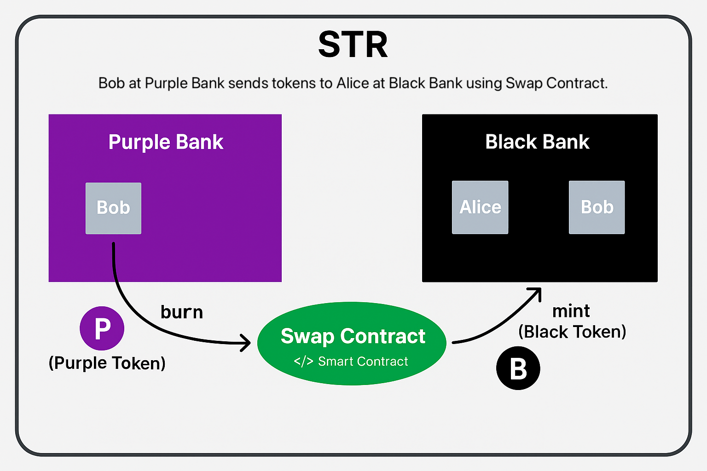

# 💸 Drex sample

This project implements a system for transferring tokenized Brazilian Real (BRL) between different banks using smart contracts. It simulates the swap of tokens between customers of distinct banks through a decentralized contract.

## 📌 Overview

The project is composed of three main components:

- **Bank Tokens**: Each bank issues its own token (e.g., Purple Token, Black Token).
- **Swap Contract**: A smart contract that performs the `burn` of the token on the origin bank and the `mint` of the equivalent token on the destination bank.
- **STR Coordinator**: A central logic layer that governs and ensures the integrity of all operations.

## 🧠 How It Works

1. **Bob**, a client of **Purple Bank**, holds Purple Tokens.
2. Bob wants to transfer tokens to **Alice**, a client of **Black Bank**.
3. The **Purple Bank** calls the `Swap Contract`:
   - Calls `burn()` on Bob’s Purple Token.
   - Calls `mint()` of the Black Token to Alice’s account at Black Bank.
4. The transfer is completed securely and transparently.

## 🖼️ Diagram

Below is a diagram showing the token flow between banks:

## 🧱 Technical Components

- **Smart Contracts**:
  - RealDigital.sol (ERC-20 that represents Brazilian Real (BRL) between banks)
  - RealTokenizado.sol (ERC-20 that represents Brazilian Real (BRL) between individuals)
  - STR.sol (The central authority responsible for system governance)
  - SwapOneStep.sol (In charge of transferring RealToken between two different banks)
